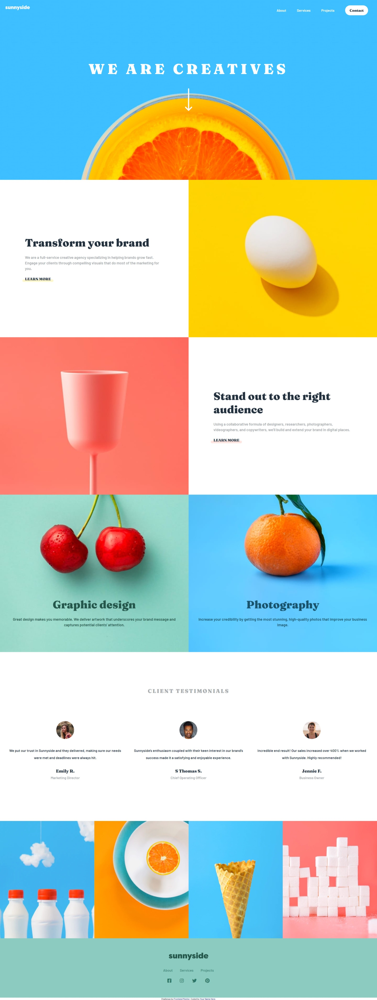
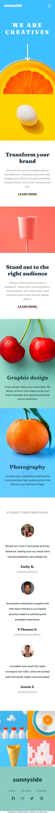

# Frontend Mentor - Sunnyside agency landing page solution

This is a solution to the [Sunnyside agency landing page challenge on Frontend Mentor](https://www.frontendmentor.io/challenges/sunnyside-agency-landing-page-7yVs3B6ef). Frontend Mentor challenges help you improve your coding skills by building realistic projects.

## Table of contents

- [Overview](#overview)
  - [The challenge](#the-challenge)
  - [Screenshot](#screenshot)
  - [Links](#links)
- [My process](#my-process)
  - [Built with](#built-with)
  - [Continued development](#continued-development)
- [Author](#author)

## Overview

### The challenge

Users should be able to:

- View the optimal layout for the site depending on their device's screen size
- See hover states for all interactive elements on the page

### Screenshot

### Links

- Solution URL: [https://github.com/Dharmik48/fem-sunny-agency-landing-page](https://github.com/Dharmik48/fem-sunny-agency-landing-page)
- Live Site URL: [https://dharmik48.github.io/fem-sunny-agency-landing-page/](https://dharmik48.github.io/fem-sunny-agency-landing-page/)

## My process

### Built with

- Mobile-first workflow
- Semantic HTML5 markup
- CSS custom properties
- CSS Grid
- Flexbox

### Continued development

The new 'gap' property for FlexBox is a game changer so, definetly using it in future.

## Author

- Website - [Dharmik](https://github.com/Dharmik48)
- Frontend Mentor - [@Dharmik48](https://www.frontendmentor.io/profile/Dharmik48)
